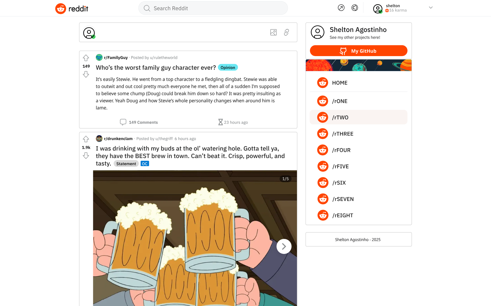
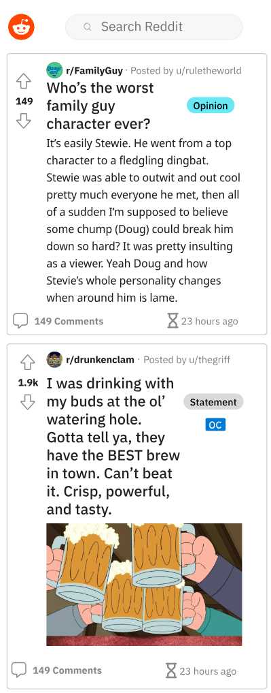
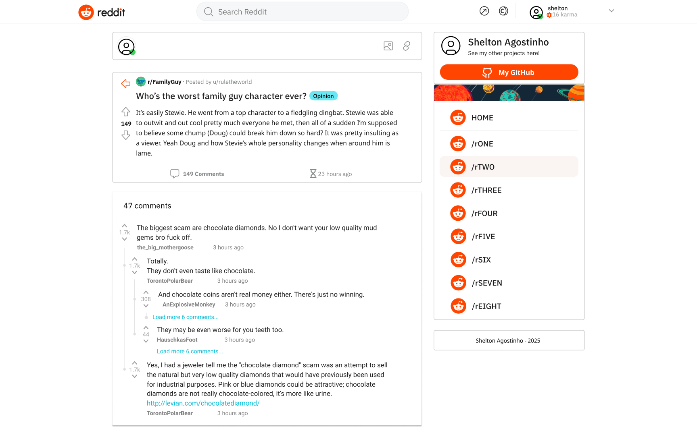
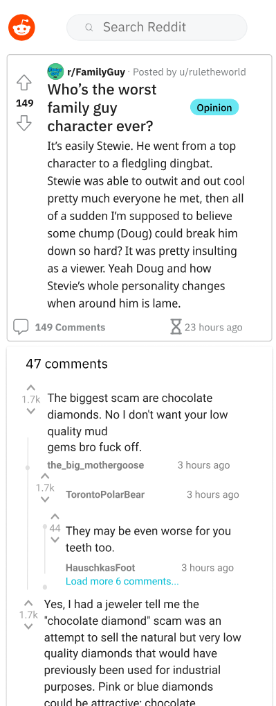
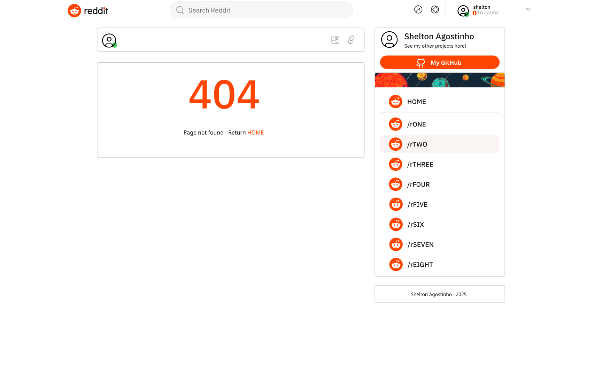
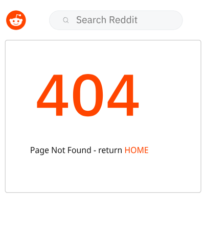

# Minimal Reddit
Live view: [Here](https://reddit-lazio.netlify.app/)

## Description

This project is a minimal functional Reddit application using React, Typescript and Redux. Reddit is a well-known platform where users share links to articles, media, and various web content. By leveraging the Reddit API, this application fetches real-time data, allowing users to view and search posts and comments directly from Reddit. This project not only demonstrates the ability to integrate external APIs but also showcases skills in managing application state with Redux and building interactive, responsive user interfaces with React. There is use of local storage to handle the limited number of API calls.

## Wireframes

Below are the wireframes that outline the structure and layout of the main screens of the project.

### Posts - Web view

### Posts - Mobile view

### Comments - Web view

### Comments - Mobile view

### Page not found - Web view

### Page not found - Mobile view

 
*Note: These wireframes were developed during the planning phase to help define the UI and user experience.*

## Technologies Used

The project is built with the following technologies:

## Technologies Used

    - 
   -  -  -   

## Features

Key features of the project include:

- **Posts and Comments Display:** Users can view posts and comments from various subreddits.
- **Dynamic Navigation:** Smooth, client-side routing between posts and comments pages.
- **Data Loading and Caching:** Implements caching strategies to optimize API calls and improve performance.
- **Animations and Interactivity:** Includes subtle animations to enhance the user experience.
- **Responsive Design:** The layout adapts to different screen sizes for an optimal experience on both mobile and desktop devices.
- **Nested Comments Improvement:** Improves display and interaction with nested subcomments.

## Future Work

Planned enhancements for future versions of the project include:

- **User Authentication:** Implementing login and user profiles for a personalized experience.
- **Performance Optimization:** Refining caching strategies and minimizing unnecessary re-renders.
- **Expanded Testing:** unit and end-to-end test coverage to ensure stability.
- **Additional API Integrations:** Exploring further integrations with other APIs to enrich the content and functionality.

---

*Shelton Agostinho - 2025*
